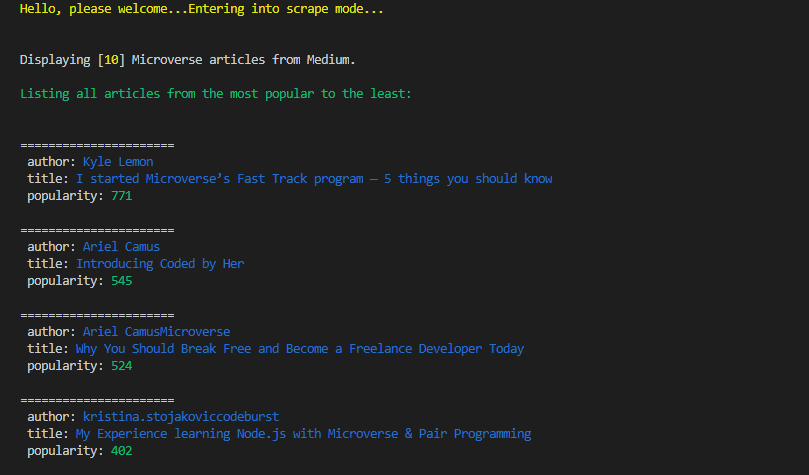

# Web_Scraper
This web scraper is built using Ruby Programming language.

## Project Design:

This project is Web Scraper that takes information from Medium Website. It scrapes some articles written by Microverse students & any other articles that have anything to do with Microverse in generall. The scraper takes the information retrieved from the website & uses Nokogiri gem to store everything as an array of objects. I then took this array of objects & retrieve each article information and display it in a way that's more readable & organised. The articles are displayed in discending order based on the number of claps ( which in this case is the popularity that you see when you run the code. )

## Built With

- Ruby
- Rspec (testing)
- HTTParty
- Nokogiri
- Rubocop
- Colorize
- Pry (for debugging)

## SetUp
To get this project on your machine & contribute to the project, you can run <code>git clone https://github.com/ClaytonSiby/Software-Developers-Summit.git</code> on the command line and create a feature branch to your directory both locally and remotely.

## Tools Used:

- Visual Studio Code

## Live Demo

[Live Demo Link](https://raw.githack.com/ClaytonSiby/Software-Developers-Summit/master/idesign/index.html)

## Author

👤 **Clayton Siby**

- Github: [@Clayton Siby](https://github.com/ClaytonSiby)
- Twitter: [@ClaytonSiby](https://twitter.com/ClaytonSiby)
- Linkedin: [linkedin](https://www.linkedin.com/in/clayton-siby-48a8a0183/)
- claytonsiby@gmail.com

# 🤝 Contributing

Contributions, issues and feature requests are welcome!

Feel free to check the [issues page](https://github.com/ClaytonSiby/Software-Developers-Summit/issues).

## Please show your support

Give a ⭐️ if you like this project!

## Acknowledgments

- Hat tip to [Cindy Shin in Behance](https://www.behance.net/adagio07) 
- StackOverflow
- W3Schools.com
- getbootstrap.com

# 📝 License

This project is [MIT](https://creativecommons.org/licenses/by-nc/4.0/) licensed.
